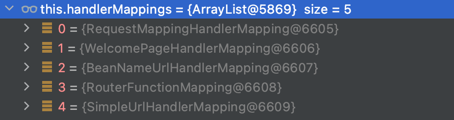
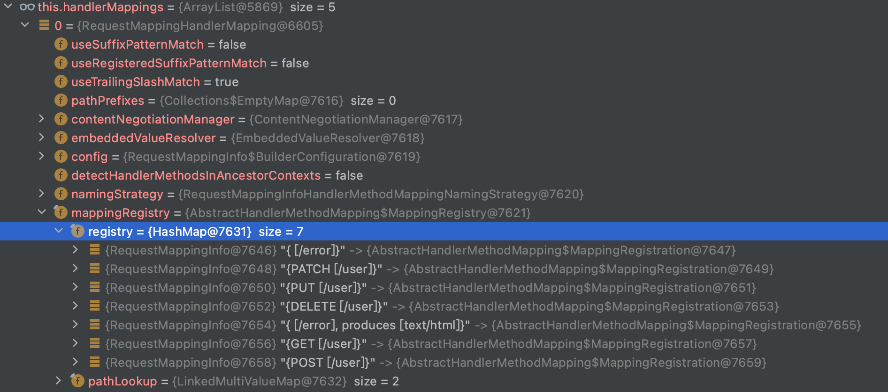
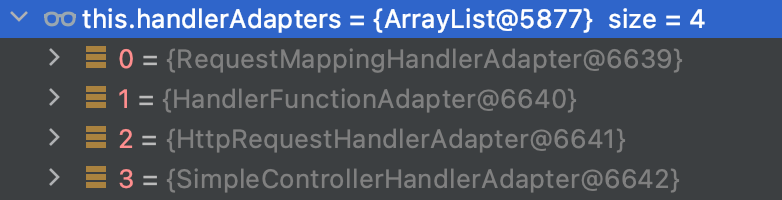

Web 开发
===

# 1 Spring MVC 自动配置概览

参考文档： [Spring MVC Auto-configuration](https://docs.spring.io/spring-boot/docs/current/reference/html/features.html#features.developing-web-applications)

Spring Boot 为 Spring MVC 提供了自动配置，适用于大多数应用程序。

自动配置在 Spring 的默认值之上添加了以下功能：

- 包含内容协商解析起 `ContentNegotiatingViewResolver` 和BeanName视图解析器 `BeanNameViewResolver` 组件
- 支持提供静态资源，包括对 WebJars 的支持
- 自动注册 `Converter`，`GenericConverter` 和 `Formatter` 组件
- 支持 `HttpMessageConverters`（后来我们配合内容协商理解原理）
- 自动注册 `MessageCodesResolver`（国际化）
- 静态 `index.html` 页支持
- 自定义 Favicon  
- 自动使用 `ConfigurableWebBindingInitializer` ，（DataBinder负责将请求数据绑定到JavaBean上）

如果您想保留那些 Spring Boot MVC 自定义并进行更多 MVC 自定义（拦截器、格式化程序、视图控制器和其他功能），您可以添加自己的 WebMvcConfigurer 类型的 `@Configuration` 类，但不添加 `@EnableWebMvc`。

如果您想提供 `RequestMappingHandlerMapping``、RequestMappingHandlerAdapter` 或 `ExceptionHandlerExceptionResolver` 的自定义实例，并且仍然保留 Spring Boot MVC 自定义，您可以声明一个类型为 `WebMvcRegistrations` 的组件并使用它来提供这些组件的自定义实例。

如果您想**完全控制** Spring MVC，您可以添加您自己的带有 `@EnableWebMvc` 注释的 `@Configuration`，或者添加您自己的 @Configuration-annotated `DelegatingWebMvcConfiguration`，如@EnableWebMvc 的 Javadoc 中所述。

# 2 简单功能分析

## 2.1 静态资源访问

参考文档：[Static Content](https://docs.spring.io/spring-boot/docs/current/reference/html/features.html#features.developing-web-applications.spring-mvc.static-content)

1. 静态资源目录

默认情况下，Spring Boot 提供来自**类路径**或 **ServletContext 根目录**中名为 `/static`（或 `/public` 或 `/resources` 或 `/META-INF/resources`）的目录中的静态内容。

可以通过 `spring.web.resources.static-locations` 属性对静态资源目录进行调整。例如将静态资源目录设置为类路径下的 `/my-static/` 目录。

```yaml
spring:
  web:
    resources:
      static-locations: [classpath: /my-static/]
```

注：`static-locations` 中总是包含 `/META-INF/resources`（迷惑）

2. 静态资源访问前缀

默认情况下，静态资源会在 `/**` 路径上添加一个最低优先级的处理器映射

可以使用 `spring.mvc.static-path-pattern` 属性对其进行调整。例如，将所有资源重定位到 `/resources/**` 可以实现如下：

```yaml
spring:
  mvc:
    static-path-pattern: /resources/**
```

3. WebJars

WebJars 可以通过 `webjars/**` 路径对 WebJars 中的静态资源进行访问。

添加一个 jquery WebJars 依赖

```xml
<dependency>
    <groupId>org.webjars</groupId>
    <artifactId>jquery</artifactId>
    <version>3.6.0</version>
</dependency>
```

WebJars 的目录结构如下：

```
jquery-3.6.0.jar
└── META-INF
    ├── MANIFEST.MF
    ├── maven
    │   └── org.webjars
    │       └── jquery
    │           ├── pom.properties
    │           └── pom.xml
    └── resources
        └── webjars
            └── jquery
                └── 3.6.0
                    ├── jquery.js
                    ├── jquery.min.js
                    ├── jquery.min.map
                    ├── jquery.slim.js
                    ├── jquery.slim.min.js
                    ├── jquery.slim.min.map
                    └── webjars-requirejs.js
```

根据 WebJars 的目录结构可以通过 `localhost:8080/webjars/jquery/3.6.0/jquery.js` 访问 `jquery.js` 文件

注：WebJars 资源与 `spring.web.resources.static-locations` 和 `spring.mvc.static-path-pattern` 属性配置无关


## 2.2 欢迎页和 Favicon

参考：[Welcome Page](https://docs.spring.io/spring-boot/docs/current/reference/html/features.html#features.developing-web-applications.spring-mvc.welcome-page)

Spring Boot 支持**静态**和**模板化**欢迎页面。它首先在配置的静态内容位置查找 `index.html` 文件。如果未找到，则查找索引模板。如果找到其中之一，它会自动用作应用程序的欢迎页面。

将 favicon.ico 文件放入配置的静态路径中即可设定网页的 `Favicon`

## 2.3 静态资源配置原理

Spring Boot 启动默认加载 `XxxAutoConfiguration` 类（自动配置类），Spring MVC 功能的自动配置类 `WebMvcAutoConfiguration`。

`WebMvcAutoConfiguration` 自动配置类定义如下，并且自动配置生效。

```java
@Configuration(proxyBeanMethods = false)
@ConditionalOnWebApplication(type = Type.SERVLET)
@ConditionalOnClass({ Servlet.class, DispatcherServlet.class, WebMvcConfigurer.class })
@ConditionalOnMissingBean(WebMvcConfigurationSupport.class)
@AutoConfigureOrder(Ordered.HIGHEST_PRECEDENCE + 10)
@AutoConfigureAfter({ DispatcherServletAutoConfiguration.class, TaskExecutionAutoConfiguration.class,
		ValidationAutoConfiguration.class })
public class WebMvcAutoConfiguration {
    // ...
}
```

该配置向容器中注册了一些组件和配置定义。

`WebMvcAutoConfiguration` 类中包含了一个配置定义如下：

```java
@Configuration(proxyBeanMethods = false)
@Import(EnableWebMvcConfiguration.class)
@EnableConfigurationProperties({ WebMvcProperties.class,
        org.springframework.boot.autoconfigure.web.ResourceProperties.class, WebProperties.class })
@Order(0)
public static class WebMvcAutoConfigurationAdapter implements WebMvcConfigurer, ServletContextAware {
    // ...
}
```

其中 `@EnableConfigurationProperties` 注解将配置文件和类进行绑定：

- 配置文件中的 `spring.mvc` 属性和 `WebMvcProperties` 进行绑定
- 配置文件中的 `spring.web` 属性和 `WebProperties` 进行绑定
- 配置文件中的 `spring.resources` 属性和 `ResourceProperties` 进行绑定

其中 `WebMvcAutoConfiguration` 这个配置类只有一个有参构造器，有参构造器中所有的参数都会从容器中获取。

```java
// resourceProperties 从容器中获取和 spring.resources 配置绑定的对象
// webProperties 从容器中获取和 spring.web 配置绑定的对象
// mvcProperties 从容器中获取和 spring.mvc 配置绑定的对象
// beanFactory Spring 的 IoC 容器
// messageConvertersProvider 从容器中获取所有的 HTTP 消息转换器
// resourceHandlerRegistrationCustomizerProvider 从容器中获取资源处理器的自定义器
// ...
public WebMvcAutoConfigurationAdapter(
        org.springframework.boot.autoconfigure.web.ResourceProperties resourceProperties,
        WebProperties webProperties, WebMvcProperties mvcProperties, ListableBeanFactory beanFactory,
        ObjectProvider<HttpMessageConverters> messageConvertersProvider,
        ObjectProvider<ResourceHandlerRegistrationCustomizer> resourceHandlerRegistrationCustomizerProvider,
        ObjectProvider<DispatcherServletPath> dispatcherServletPath,
        ObjectProvider<ServletRegistrationBean<?>> servletRegistrations) {
    this.resourceProperties = resourceProperties.hasBeenCustomized() ? resourceProperties
            : webProperties.getResources();
    this.mvcProperties = mvcProperties;
    this.beanFactory = beanFactory;
    this.messageConvertersProvider = messageConvertersProvider;
    this.resourceHandlerRegistrationCustomizer = resourceHandlerRegistrationCustomizerProvider.getIfAvailable();
    this.dispatcherServletPath = dispatcherServletPath;
    this.servletRegistrations = servletRegistrations;
    this.mvcProperties.checkConfiguration();
}
```

配置静态资源映射

```java
@Override
public void addResourceHandlers(ResourceHandlerRegistry registry) {
    if (!this.resourceProperties.isAddMappings()) {
        logger.debug("Default resource handling disabled");
        return;
    }
    // 将 /webjars/** 路径和 lasspath:/META-INF/resources/webjars/ 中的资源进行映射
    addResourceHandler(registry, "/webjars/**", "classpath:/META-INF/resources/webjars/");
    // 将 spring.mvc.static-path-pattern 属性和 spring.web.resources.static-locations 中的资源进行映射
    addResourceHandler(registry, this.mvcProperties.getStaticPathPattern(), (registration) -> {
        registration.addResourceLocations(this.resourceProperties.getStaticLocations());
        if (this.servletContext != null) {
            ServletContextResource resource = new ServletContextResource(this.servletContext, SERVLET_LOCATION);
            registration.addResourceLocations(resource);
        }
    });
}
```

欢迎页处理器映射

```java
@Bean
public WelcomePageHandlerMapping welcomePageHandlerMapping(ApplicationContext applicationContext,
        FormattingConversionService mvcConversionService, ResourceUrlProvider mvcResourceUrlProvider) {
    WelcomePageHandlerMapping welcomePageHandlerMapping = new WelcomePageHandlerMapping(
            new TemplateAvailabilityProviders(applicationContext), applicationContext, getWelcomePage(),
            this.mvcProperties.getStaticPathPattern());
    welcomePageHandlerMapping.setInterceptors(getInterceptors(mvcConversionService, mvcResourceUrlProvider));
    welcomePageHandlerMapping.setCorsConfigurations(getCorsConfigurations());
    return welcomePageHandlerMapping;
}
```

其中欢迎页的映射规则如下

```java
WelcomePageHandlerMapping(TemplateAvailabilityProviders templateAvailabilityProviders,
        ApplicationContext applicationContext, Resource welcomePage, String staticPathPattern) {
    // index 页面不为空并且静态资源映射路径为 /** 则 forward 到 index.html
    if (welcomePage != null && "/**".equals(staticPathPattern)) {
        logger.info("Adding welcome page: " + welcomePage);
        setRootViewName("forward:index.html");
    }
    // 否则调用 controller 处理
    else if (welcomeTemplateExists(templateAvailabilityProviders, applicationContext)) {
        logger.info("Adding welcome page template: index");
        setRootViewName("index");
    }
}
```

# 3 请求处理

- Rest风格支持（使用HTTP请求方式动词来表示对资源的操作）
    - 获取用户： `GET /user`
    - 创建用户： `POST /user`
    - 修改用户： `PUT /user`
    - 删除用户： `DELETE /user`
- 核心Filter：`HiddenHttpMethodFilter`
- 使用方法：
    - 表单 `method=post`
    - 隐藏域 `_method=PUT/PATCH/DELETE`
- SpringBoot中手动开启
    - 因为不是所有场景都需要开启
    - 将 spring.mvc.hiddenmethod.filter.enabled 属性配置为 true 即可开启
- `@XxxRequestMapping(value = "/user")` 替代 `@RequestMapping(value = "/user", method = RequestMethod.XXX)`

REST 原理

1. HTML 表单使用 REST

因为 HTML 表单只支持 GET，POST 请求，所以如果想发送 REST 请求需要创建 `HiddenHttpMethodFilter` 过滤器

`HiddenHttpMethodFilter` 的创建条件是容器中没有其他 `HiddenHttpMethodFilter` 组件并且 `spring.mvc.hiddenmethod.filter.enabled` 属性开启。

```java
@Bean
@ConditionalOnMissingBean(HiddenHttpMethodFilter.class)
@ConditionalOnProperty(prefix = "spring.mvc.hiddenmethod.filter", name = "enabled")
public OrderedHiddenHttpMethodFilter hiddenHttpMethodFilter() {
    return new OrderedHiddenHttpMethodFilter();
}
```

`HiddenHttpMethodFilter` 的使用条件是请求方法是 `POST` ，请求没有出现异常并且请求的 `_method` 参数值为 `PUT`，`PATCH` 或者 `DELETE` 其中之一。

```java
protected void doFilterInternal(HttpServletRequest request, HttpServletResponse response, FilterChain filterChain) throws ServletException, IOException {
    HttpServletRequest requestToUse = request;
    if ("POST".equals(request.getMethod()) && request.getAttribute("javax.servlet.error.exception") == null) {
        String paramValue = request.getParameter(this.methodParam);
        if (StringUtils.hasLength(paramValue)) {
            String method = paramValue.toUpperCase(Locale.ENGLISH);
            if (ALLOWED_METHODS.contains(method)) {
                requestToUse = new HiddenHttpMethodFilter.HttpMethodRequestWrapper(request, method);
            }
        }
    }

    filterChain.doFilter((ServletRequest)requestToUse, response);
}
```

表单请求会被 `HiddenHttpMethodFilter` 拦截，如果请求方法是 `POST` 并且 `_method` 参数值是 `PUT`，`DELETE`，`PATCH` 其中之一，原生 HTML 请求会被包装成 `RequestWrapper`。包装后的 `RequestWrapper` 的 `getMethod` 方法返回的 `_method` 参数设定的方法。过滤器放行的后续的请求使用的是包装后的 `RequestWrapper`。

> **Tip**：将默认参数 `_method` 名替换成指定参数名
> 通过自定义一个 `HiddenHttpMethodFilter` 组件，修改组件的 `methodParam` 属性就会在过滤逻辑使用对应的参数。
>
> ```java
> @Bean
> public HiddenHttpMethodFilter hiddenHttpMethodFilter(){
>     HiddenHttpMethodFilter methodFilter = new HiddenHttpMethodFilter();
>     methodFilter.setMethodParam("_m");
>     return methodFilter;
> }
> ```


2. 使用客户端工具发送 REST 请求

直接发送 `PUT`, `PATCH`, `DELETE` 方法即可，无需 `Filter`。


# 4 请求映射的原理

`DispatcherServlet` 是所有请求的入口，其依赖关系如下。

```
GenericServlet (javax.servlet)
    HttpServlet (javax.servlet.http)    [doGet/doPost/...]
        HttpServletBean (org.springframework.web.servlet)
            FrameworkServlet (org.springframework.web.servlet)    [processRequest]
                DispatcherServlet (org.springframework.web.servlet)   [doService -> doDispatch]
```


`HttpServlet` 的 `doGet` / `doPost` 等方法在 `FrameworkServlet` 中被重写并调用 `FrameworkServlet` 的 `processRequest` 方法来处理请求。

```java
@Override
protected final void doGet(HttpServletRequest request, HttpServletResponse response)
        throws ServletException, IOException {

    processRequest(request, response);
}
```

`FrameworkServlet` 的 `processRequest` 又会调用 `DispatcherServlet` 的 `doService` 来处理请求

```java
protected final void processRequest(HttpServletRequest request, HttpServletResponse response)
    // ...
    try {
        doService(request, response);
    }
    // ...
}
```

`DispatcherServlet` 的 `doService` 方法又会调用 `DispatcherServlet` 的 `doDispatch` 方法

```java
@Override
protected void doService(HttpServletRequest request, HttpServletResponse response) throws Exception {
    logRequest(request);
    // ...
    try {
        doDispatch(request, response);
    }
    // ...
}
```

`DispacherServlet` 的 `doDispatch` 方法是请求映射的重点，每个请求都会执行该方法。

```java
protected void doDispatch(HttpServletRequest request, HttpServletResponse response) throws Exception {
    // ...
    // 找到当前请求使用哪个处理器进行处理
    mappedHandler = getHandler(processedRequest);
    if (mappedHandler == null) {
        noHandlerFound(processedRequest, response);
        return;
    }

    // Determine handler adapter for the current request.
    HandlerAdapter ha = getHandlerAdapter(mappedHandler.getHandler());
    // ...
}
```

DispatcherServlet 遍历容器中注册的所有处理器映射中寻找能够处理请求的处理器映射并返回。

```java
@Nullable
protected HandlerExecutionChain getHandler(HttpServletRequest request) throws Exception {
    if (this.handlerMappings != null) {
        for (HandlerMapping mapping : this.handlerMappings) {
            HandlerExecutionChain handler = mapping.getHandler(request);
            if (handler != null) {
                return handler;
            }
        }
    }
    return null;
}
```

Spring Boot 自动配置一些 `HandlerMapping`:



1. `RequestMappingHandlerMapping`：保存了所有 `@RequestMapping` 和 `Handler` 的映射规则

```java
@Bean
@Primary
@Override
public RequestMappingHandlerMapping requestMappingHandlerMapping(
        @Qualifier("mvcContentNegotiationManager") ContentNegotiationManager contentNegotiationManager,
        @Qualifier("mvcConversionService") FormattingConversionService conversionService,
        @Qualifier("mvcResourceUrlProvider") ResourceUrlProvider resourceUrlProvider) {
    // Must be @Primary for MvcUriComponentsBuilder to work
    return super.requestMappingHandlerMapping(contentNegotiationManager, conversionService,
            resourceUrlProvider);
}
```



2. `WelcomePageHandlerMapping`：访问 `/` 能访问到 `index.html`。

```java
@Bean
public WelcomePageHandlerMapping welcomePageHandlerMapping(ApplicationContext applicationContext,
        FormattingConversionService mvcConversionService, ResourceUrlProvider mvcResourceUrlProvider) {
    WelcomePageHandlerMapping welcomePageHandlerMapping = new WelcomePageHandlerMapping(
            new TemplateAvailabilityProviders(applicationContext), applicationContext, getWelcomePage(),
            this.mvcProperties.getStaticPathPattern());
    welcomePageHandlerMapping.setInterceptors(getInterceptors(mvcConversionService, mvcResourceUrlProvider));
    welcomePageHandlerMapping.setCorsConfigurations(getCorsConfigurations());
    return welcomePageHandlerMapping;
}

WelcomePageHandlerMapping(TemplateAvailabilityProviders templateAvailabilityProviders,
        ApplicationContext applicationContext, Resource welcomePage, String staticPathPattern) {
    if (welcomePage != null && "/**".equals(staticPathPattern)) {
        logger.info("Adding welcome page: " + welcomePage);
        setRootViewName("forward:index.html");
    }
    else if (welcomeTemplateExists(templateAvailabilityProviders, applicationContext)) {
        logger.info("Adding welcome page template: index");
        setRootViewName("index");
    }
}
```
3. BeanNameUrlHandlerMapping
4. RouterFunctionMapping
5. SimpleUrlHandlerMapping

# 5 请求参数

## 5.1 普通参数与基本注解

注解：

`@PathVariable`：路径变量
`@RequestHeader`：请求头
`@RequestParam`：请求参数
`@RequestBody`：请求体
`@CookieValue`：Cookie值


`@RequestAttribute`：请求域属性

```java
@Controller
public class RequestAttributeController {
    @RequestMapping("/forward")
    public String forward(HttpServletRequest request) {
        request.setAttribute("msg", "成功");
        request.setAttribute("code", 200);
        return "forward:/success";
    }

    @ResponseBody
    @RequestMapping("/success")
    public Map<String, Object> success(@RequestAttribute("msg") String msg, @RequestAttribute("code") Integer code, HttpServletRequest request) {
        Object msg1 = request.getAttribute("msg");
        Map<String, Object> map = new HashMap<>();
        map.put("msg", msg);
        map.put("msg1", msg1);
        map.put("code", code);
        return map;
    }
}
```

`@MatrixVariable`：

Spring Boot 中默认禁用了矩阵变量功能，在 WebMvcAutoConfiguration 中会使用 UrlPathHelper 来配置路径匹配。

```java
@Override
public void configurePathMatch(PathMatchConfigurer configurer) {
    if (this.mvcProperties.getPathmatch()
            .getMatchingStrategy() == WebMvcProperties.MatchingStrategy.PATH_PATTERN_PARSER) {
        configurer.setPatternParser(new PathPatternParser());
    }
    configurer.setUseSuffixPatternMatch(this.mvcProperties.getPathmatch().isUseSuffixPattern());
    configurer.setUseRegisteredSuffixPatternMatch(
            this.mvcProperties.getPathmatch().isUseRegisteredSuffixPattern());
    this.dispatcherServletPath.ifAvailable((dispatcherPath) -> {
        String servletUrlMapping = dispatcherPath.getServletUrlMapping();
        if (servletUrlMapping.equals("/") && singleDispatcherServlet()) {
            UrlPathHelper urlPathHelper = new UrlPathHelper();
            urlPathHelper.setAlwaysUseFullPath(true);
            configurer.setUrlPathHelper(urlPathHelper);
        }
    });
}
```

UrlPathHelper 是用于 URL 路径匹配的 Helper 类。在 RequestDispatcher 中提供对 URL 路径的支持，并支持一致的 URL 解码。

UrlPathHelper 包含一个 removeSemicolonContent 属性，该属性默认值为 true，会将 `;` 内容从请求 URI 中删除，所以默认情况下矩阵变量功能不生效。

使用自定义的 UrlPathHelper

1. @Bean

```java
@Configuration
public class WebConfiguration {
    @Bean
    public WebMvcConfigurer webMvcConfigurer() {
        return new WebMvcConfigurer() {
            @Override
            public void configurePathMatch(PathMatchConfigurer configurer) {
                UrlPathHelper urlPathHelper = new UrlPathHelper();
                urlPathHelper.setRemoveSemicolonContent(false);
                configurer.setUrlPathHelper(urlPathHelper);
            }
        };
    }
}
```

2. @Configuration + 实现 WebMvcConfigurer

```java
@Configuration
public class WebConfiguration implements WebMvcConfigurer {
    @Override
    public void configurePathMatch(PathMatchConfigurer configurer) {
        UrlPathHelper urlPathHelper = new UrlPathHelper();
        urlPathHelper.setRemoveSemicolonContent(false);
        configurer.setUrlPathHelper(urlPathHelper);
    }
}
```

测试

矩阵变量要想生效必须有 `URL` 路径变量，如果多个路径变量有相同的矩阵变量，要通过 `pathVar` 指定对应的路径变量。

```java
// localhost:8080/cars/sell;low=200000;brand=audi,benz,bwm
// {"low":200000,"sell":"sell","brand":["audi","benz","bwm"]}
@GetMapping("/cars/{sell}")
public Map<String, Object> carsSell(@MatrixVariable("low") Integer low, @MatrixVariable("brand") List<String> brand,
        @PathVariable("sell") String sell) {
    Map<String, Object> map = new HashMap<>();
    map.put("low", low);
    map.put("brand", brand);
    map.put("sell", sell);
    return map;
}

// localhost:8080/boss/1;age=45/emp/6;age=24
// {"bossAge":45,"empAge":24}
@RequestMapping("/boss/{bossId}/emp/{empId}")
public Map<String, Object> bossEmp(@MatrixVariable(value = "age", pathVar = "bossId") Integer bossAge,
        @MatrixVariable(value = "age", pathVar = "empId") Integer empAge) {
    Map<String, Object> map = new HashMap<>();
    map.put("bossAge", bossAge);
    map.put("empAge", empAge);
    return map;
}
```

`@ModelAttribute`：

Servlet API：

`WebRequest`、`ServletRequest`、`MultipartRequest`、`HttpSession`、`javax.servlet.http.PushBuilder`、`Principal`、`InputStream`、`Reader`、`HttpMethod`、`Locale`、`TimeZone`、`ZoneId`

复杂数据：

`Map`、`Model`（map、model里面的数据会被放在request的请求域  request.setAttribute）、`Errors`/`BindingResult`、`RedirectAttributes`（ 重定向携带数据）、`ServletResponse`（response）、`SessionStatus`、`UriComponentsBuilder`、`ServletUriComponentsBuilder`。

## 5.2 参数处理原理

- HandlerMapping中找到能处理请求的Handler（Controller.method()）
- 为当前Handler 找一个适配器 HandlerAdapter； RequestMappingHandlerAdapter
- 适配器执行目标方法并确定方法参数的每一个值



- RequestMappingHandlerAdapter 支持标注 @RequestMapping 的处理器
- HandlerFunctionAdapter 支持函数式编程